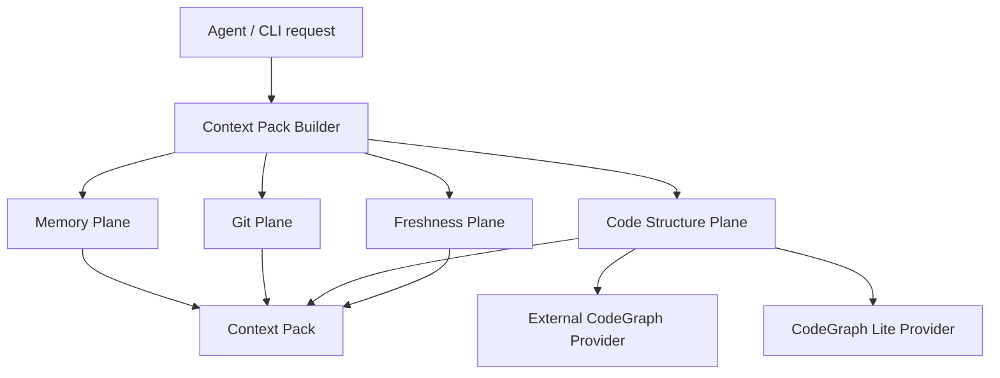

# CodeGraph Memory / Context Fabric Design

Date: 2026-06-29
Branch: `codex/1.1.3-codegraph-memory`
Status: proposed

## Summary

Memorix should not compete in the "store more text context" lane. Stronger coding agents can often re-read a repository, inspect current files, and self-summarize faster than a noisy text memory system can help. The value of memory for coding agents now depends on whether it can produce less context, with higher trust, tied to current code facts.

This design turns Memorix from a session-memory system into a context fabric:

- Memory captures decisions, gotchas, reasoning, and session history.
- Git Memory captures what actually changed.
- CodeGraph Memory captures current code structure.
- Freshness checks decide whether older memories are still reliable.
- Context Pack Builder returns a task-ready packet instead of a loose list of memories.

The product promise is:

> Coding agents do not need more memory. They need trustworthy working context.

## Background

Agent memory projects often assume that users and agents need more persistent context. That assumption is weaker now. More context can be harmful when it is stale, noisy, contradictory, or unrelated to the active task. For coding agents, the most valuable context is usually:

- current code structure,
- recent changes,
- durable decisions,
- known gotchas,
- relevant tests,
- and a clear signal about what is stale.

Agentmemory implements an advanced text/session memory stack: hooks, compressed observations, consolidation, BM25/vector search, graph extraction, lessons, working memory, retention, and file history. Its official pairing docs place CodeGraph as a separate code-structure plane beside agentmemory's session-history plane. That validates the multi-plane model, but it does not make memory itself structurally aware.

Memorix should own the unified layer above those planes.

## Goals

1. Make memory useful only when it reduces exploration cost or risk.
2. Bind memories to current code facts through file and symbol references.
3. Detect stale or suspect memories when code changes.
4. Support external CodeGraph providers without making users or agents manually orchestrate multiple tools.
5. Provide an internal CodeGraph Lite fallback for common projects.
6. Expose a single agent-facing context pack API.

## Non-Goals

- Do not build a full IDE-grade language server in the first version.
- Do not require users to install a third-party CodeGraph tool.
- Do not dump full code graphs into model context.
- Do not turn every observation into a code memory.
- Do not replace normal file reads; the pack should point agents to the right files and symbols.

## Design Principles

### Memory Must Earn Context

Memorix should not inject memory merely because memory exists. A memory earns context when it is relevant, fresh enough, and actionable.

### Structure Is Separate From Narrative

Code structure should live in structured tables, not in observation narrative text. Observations can reference code facts, but they should not be the canonical code graph.

### Providers Are Inputs, Not Product Boundaries

External CodeGraph tools can be excellent data sources. Memorix should use them when available, but the agent-facing product remains Memorix context packs.

### Freshness Must Be Visible

Every code-bound memory should report whether it is:

- `current`: the referenced file or symbol still matches the captured state.
- `suspect`: the file changed since capture and needs review.
- `stale`: the referenced file or symbol no longer exists.
- `unbound`: the memory has no reliable code reference.

### Context Packs Serve Action

A context pack should answer:

- what past knowledge still matters,
- what current code facts matter,
- what changed recently,
- what to inspect next,
- what might be misleading,
- and which tests or commands are likely relevant.

## High-Level Architecture



## Core Components

### 1. CodeGraph Store

SQLite-backed structured code facts for a project.

Proposed tables:

```sql
code_files (
  id TEXT PRIMARY KEY,
  projectId TEXT NOT NULL,
  path TEXT NOT NULL,
  language TEXT,
  contentHash TEXT NOT NULL,
  mtimeMs INTEGER,
  sizeBytes INTEGER,
  indexedAt TEXT NOT NULL,
  gitCommit TEXT,
  UNIQUE(projectId, path)
)

code_symbols (
  id TEXT PRIMARY KEY,
  projectId TEXT NOT NULL,
  fileId TEXT NOT NULL,
  name TEXT NOT NULL,
  qualifiedName TEXT NOT NULL,
  kind TEXT NOT NULL,
  startLine INTEGER,
  endLine INTEGER,
  signature TEXT,
  contentHash TEXT,
  indexedAt TEXT NOT NULL,
  stale INTEGER NOT NULL DEFAULT 0,
  UNIQUE(projectId, fileId, qualifiedName, kind)
)

code_edges (
  id TEXT PRIMARY KEY,
  projectId TEXT NOT NULL,
  fromSymbolId TEXT,
  toSymbolId TEXT,
  fromFileId TEXT,
  toFileId TEXT,
  type TEXT NOT NULL,
  confidence REAL NOT NULL DEFAULT 1.0,
  evidence TEXT,
  indexedAt TEXT NOT NULL
)

observation_code_refs (
  id TEXT PRIMARY KEY,
  projectId TEXT NOT NULL,
  observationId INTEGER NOT NULL,
  fileId TEXT,
  symbolId TEXT,
  capturedFileHash TEXT,
  capturedSymbolHash TEXT,
  status TEXT NOT NULL,
  reason TEXT,
  createdAt TEXT NOT NULL,
  updatedAt TEXT
)
```

Stable IDs should be deterministic and project-scoped. Example:

```text
file:<sha256(projectId + path)>
symbol:<sha256(projectId + path + qualifiedName + kind)>
edge:<sha256(projectId + from + type + to)>
```

### 2. CodeGraph Provider Interface

Providers supply code facts. Memorix stores normalized results.

```ts
interface CodeGraphProvider {
  readonly name: string;
  readonly capability: 'external' | 'lite';

  detect(projectRoot: string): Promise<ProviderDetection>;
  status(projectRoot: string): Promise<CodeGraphStatus>;
  index(projectRoot: string, options?: IndexOptions): Promise<IndexResult>;
  findSymbols(query: string, options: QueryOptions): Promise<CodeSymbolHit[]>;
  getFileSymbols(path: string, options: QueryOptions): Promise<CodeSymbol[]>;
  getCallers(symbolId: string, options: QueryOptions): Promise<CodeEdgeResult>;
  getCallees(symbolId: string, options: QueryOptions): Promise<CodeEdgeResult>;
  getImpact(symbolId: string, options: QueryOptions): Promise<CodeImpactResult>;
}
```

Initial providers:

- `ExternalCodeGraphProvider`: uses a detected local CodeGraph MCP or CLI when configured and healthy.
- `CodeGraphLiteProvider`: built into Memorix; supports file indexing, import/export extraction, basic symbol extraction, and freshness.

The provider selector should prefer external CodeGraph when healthy, then fall back to Lite.

### 3. CodeGraph Lite

CodeGraph Lite is not meant to be a full language server. It should provide enough structure to improve context packs when no external provider is installed.

Initial language scope:

- TypeScript / JavaScript
- Markdown and config file references as file-level facts

Initial features:

- file inventory with content hashes,
- import/export graph,
- top-level function/class/interface/type/component extraction,
- route-like path detection for common frameworks when cheap,
- test ownership heuristics by file naming and imports,
- changed-file incremental reindex.

Later features:

- Python symbols,
- Go/Rust symbol extraction,
- better call edges,
- framework-specific routes,
- generated code exclusion.

Implementation options for Lite:

- Phase 1 can use TypeScript compiler APIs if already acceptable as a dependency, or conservative regex/scanner logic if dependency risk is too high.
- Phase 2 can adopt tree-sitter parsers selectively if package size and Windows install behavior are acceptable.

### 4. Code Reference Binder

The binder links observations to code facts.

Inputs:

- `filesModified`,
- paths found by entity extraction,
- commit-derived file lists,
- symbol names found in title/facts/narrative,
- provider search results.

Outputs:

- `observation_code_refs` rows,
- optional enrichment for `memorix_detail`,
- freshness status in context packs.

Binding policy:

- Exact file path match is high confidence.
- Exact symbol name in a referenced file is high confidence.
- Symbol name without file is medium confidence.
- Pure concept match is not enough for a symbol ref.

### 5. Freshness Checker

Freshness checks compare captured references with current code facts.

Rules:

- File path missing -> `stale`.
- File hash unchanged -> `current`.
- File hash changed but symbol still exists -> `suspect`.
- Symbol hash unchanged -> `current`.
- Symbol missing -> `stale`.
- No code ref -> `unbound`.

Freshness should run:

- when building a context pack,
- after `memorix ingest commit`,
- after explicit `memorix codegraph refresh`,
- and in background mode when lightweight watching is enabled.

### 6. Context Pack Builder

The new primary user-facing value.

Proposed MCP tool:

```text
memorix_context_pack
```

Inputs:

- `task`: natural language task,
- `limit`: optional pack size,
- `includeCode`: default true,
- `includeGit`: default true,
- `format`: `prompt | json | summary`.

Output sections:

```text
## Task
...

## Relevant Memories
- #123 current: ...
- #98 suspect: ...

## Current Code Facts
- AuthMiddleware defined at src/middleware/auth.ts:14
- Called by ...

## Recent Git Evidence
- abc123 changed ...

## Freshness Warnings
- #87 stale: referenced symbol removed

## Suggested Next Reads
1. src/middleware/auth.ts
2. tests/auth-middleware.test.ts

## Suggested Verification
- npm test -- auth
```

The context pack should be concise. It should not include full file contents unless explicitly requested.

## CLI Surface

New commands:

```bash
memorix codegraph status
memorix codegraph refresh
memorix codegraph search "auth middleware"
memorix context build "continue auth bug"
```

Existing commands to enrich:

- `memorix status`: show codegraph provider and freshness summary.
- `memorix doctor`: diagnose provider detection, index freshness, stale refs.
- `memorix memory detail`: show codeRefs when present.

## MCP Surface

Recommended first tools:

- `memorix_context_pack`: task-ready context.
- `memorix_codegraph_status`: provider/index health.

Optional later tools:

- `memorix_code_search`
- `memorix_code_impact`
- `memorix_code_refs`

Do not expose too many low-level codegraph tools by default. If the agent needs raw codegraph operations, it can still use a dedicated CodeGraph MCP. Memorix should optimize for context production.

## Data Flow

### Write Flow

```text
memorix_store / hooks / git ingest
  -> observation persisted
  -> binder attempts file/symbol refs
  -> observation_code_refs written
  -> search index updated
```

### Index Flow

```text
memorix codegraph refresh
  -> provider selected
  -> file/symbol/edge facts normalized
  -> code tables upserted
  -> stale symbols/files marked
```

### Context Flow

```text
memorix_context_pack(task)
  -> classify task intent
  -> search memories
  -> search code facts
  -> collect recent git evidence
  -> refresh bound ref status
  -> rank and trim
  -> return prompt-ready pack
```

## Ranking Model

A context item should rank higher when it has:

- strong lexical or semantic task match,
- current code binding,
- high-value memory category,
- recent git evidence,
- direct file/symbol overlap with the task,
- repeated access or reinforcement,
- or known gotcha/problem-solution type.

A context item should rank lower when it is:

- stale,
- hook-noise,
- unbound and generic,
- old with no reinforcement,
- unrelated to current changed files,
- or contradicted by newer observations.

## Configuration

Example:

```toml
[codegraph]
enabled = true
provider = "auto" # auto | external | lite | off
auto_refresh = true
max_files = 5000
exclude = ["node_modules/**", "dist/**", ".git/**"]

[context_pack]
include_code = true
include_git = true
max_tokens = 2500
stale_memory_policy = "warn" # warn | exclude | include
```

Environment override examples:

```text
MEMORIX_CODEGRAPH_PROVIDER=auto
MEMORIX_CONTEXT_PACK_MAX_TOKENS=2500
```

## Implementation Phases

### Phase 0: Design and Documentation

- Write this spec.
- Update roadmap language from "more memory" to "trustworthy working context".
- Document the distinction between text memory, code structure, and context packs.

### Phase 1: Schema and Store

- Add codegraph tables to `src/store/sqlite-db.ts`.
- Add `src/codegraph/types.ts`.
- Add `src/codegraph/store.ts`.
- Add unit tests for deterministic IDs and upsert behavior.

### Phase 2: Provider Interface and Lite Provider

- Add provider interface.
- Implement Lite file inventory and TS/JS import/export/symbol extraction.
- Add `memorix codegraph status` and `memorix codegraph refresh`.
- Add tests using fixture projects.

### Phase 3: Observation CodeRefs

- Add binder module.
- Bind explicit `filesModified` to `code_files`.
- Bind obvious symbol refs when file match exists.
- Show refs in detail output.
- Add freshness checker and stale/suspect status.

### Phase 4: Context Pack MVP

- Add `memorix_context_pack` MCP tool.
- Add `memorix context build` CLI command.
- Compose memories + code facts + git evidence + freshness warnings.
- Keep output token-bounded and prompt-ready.

### Phase 5: External CodeGraph Provider

- Detect configured external CodeGraph.
- Prefer it when healthy.
- Normalize results into Memorix schema.
- Fall back to Lite when unavailable.

### Phase 6: Hardening and Productization

- Add doctor/status diagnostics.
- Add dashboard summary.
- Add docs and examples.
- Add eval comparing memory-only vs context-pack answers.

## Testing Strategy

Unit tests:

- deterministic ID generation,
- schema migrations,
- provider selection,
- Lite parser fixtures,
- binder confidence rules,
- freshness status transitions,
- context pack ranking and trimming.

Integration tests:

- `memorix codegraph refresh` indexes a fixture repo,
- `memorix_store` creates code refs for file-backed observations,
- changed file hash marks existing refs `suspect`,
- deleted symbol marks refs `stale`,
- `memorix_context_pack` returns memories and code facts together.

Smoke tests:

- run CLI status,
- run context build on Memorix itself,
- verify output avoids full file dumps,
- verify no secret values are persisted.

## Risks

### Scope Creep

Building a full codegraph engine is too large for one release. Keep Lite intentionally narrow and make context packs the product surface.

### Dependency Weight

Tree-sitter or language parsers may add install friction, especially on Windows. Prefer pure JS or already-present dependencies until the value is proven.

### False Confidence

Bad symbol binding is worse than no binding. Binder output should include confidence and mark uncertain refs as suspect or omit them.

### Context Bloat

Context packs can become another noisy memory dump. Enforce token budgets and section caps from the beginning.

### Provider Drift

External CodeGraph tools may change CLIs or MCP schemas. Keep provider integration isolated.

## Open Decisions

1. Whether Phase 1 should include only schema/spec, or also a first Lite provider.
2. Whether TypeScript compiler APIs are acceptable as runtime dependencies.
3. Whether external CodeGraph provider support should ship before or after Lite.
4. Whether stale memories should be excluded by default or included with warnings.

Recommended defaults:

- Ship Lite first for dependable local behavior.
- Add external provider after the Memorix schema and context pack are stable.
- Include stale memories only in a warnings section, not as primary recommendations.

## Success Criteria

The feature is successful when a new agent session can ask:

```text
Continue the auth bug work. Give me project context.
```

and Memorix returns:

- relevant memories with freshness labels,
- current code symbols/files involved,
- recent commit evidence,
- stale-memory warnings,
- suggested next reads,
- and suggested verification commands.

The agent should need fewer broad repo scans and fewer memory follow-up searches to begin useful work.

